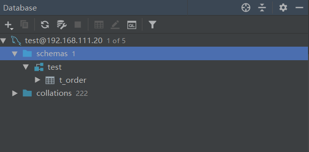
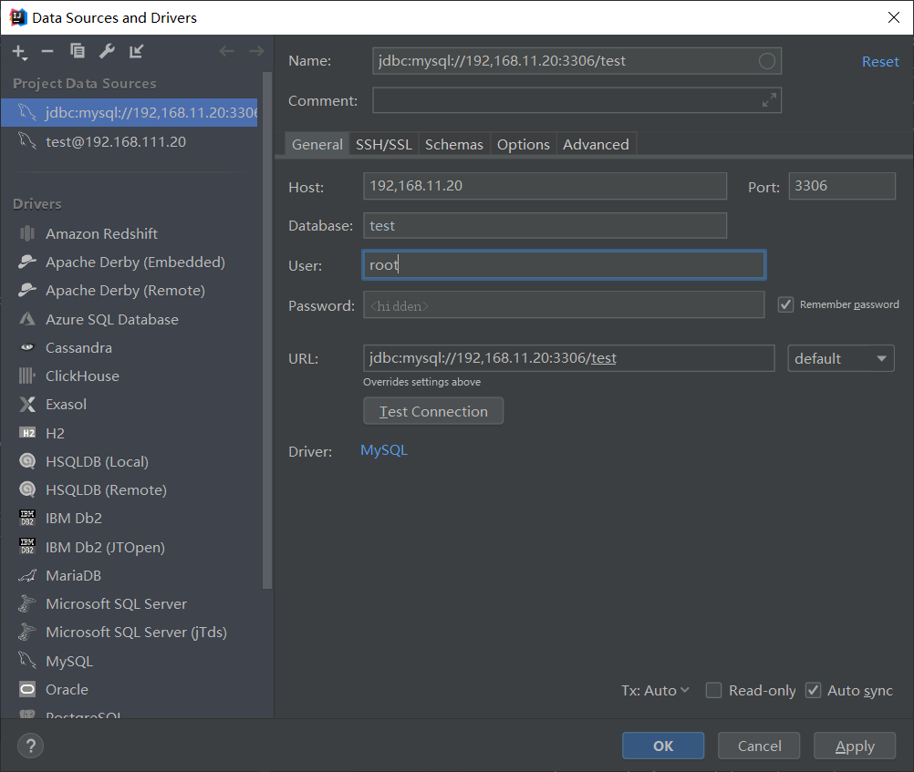
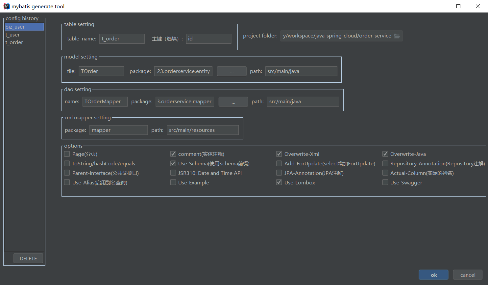

# Mybatis简单入门

## Mybatis入门

### 1.pom.xml中引入项目依赖

```xml
<dependency>
  <groupId>org.mybatis</groupId>
  <artifactId>mybatis</artifactId>
  <version>x.x.x</version>
</dependency>
```

### 2.编写配置文件

```xml
<?xml version="1.0" encoding="UTF-8" ?>
<!DOCTYPE configuration
  PUBLIC "-//mybatis.org//DTD Config 3.0//EN"
  "http://mybatis.org/dtd/mybatis-3-config.dtd">
<configuration>
  <environments default="development">
    <environment id="development">
      <transactionManager type="JDBC"/>
      <dataSource type="POOLED">
        <property name="driver" value="${driver}"/>
        <property name="url" value="${url}"/>
        <property name="username" value="${username}"/>
        <property name="password" value="${password}"/>
      </dataSource>
    </environment>
  </environments>
  <mappers>
    <mapper resource="org/mybatis/example/BlogMapper.xml"/>
  </mappers>
</configuration>
```

### 3.BlogMapper接口映射

```java
public interface BlogMapper {
  @Select("SELECT * FROM blog WHERE id = #{id}")
  Blog selectBlog(int id);
}
```

使用注解来映射简单语句会使代码显得更加简洁，但对于稍微复杂一点的语句，Java 注解不仅力不从心，还会让你本就复杂的 SQL 语句更加混乱不堪。 因此，如果你需要做一些很复杂的操作，最好用 XML 来映射语句。例如：

```xml
<?xml version="1.0" encoding="UTF-8" ?>
<!DOCTYPE mapper
  PUBLIC "-//mybatis.org//DTD Mapper 3.0//EN"
  "http://mybatis.org/dtd/mybatis-3-mapper.dtd">
<mapper namespace="org.mybatis.example.BlogMapper">
  <select id="selectBlog" resultType="Blog">
    select * from Blog where id = #{id}
  </select>
</mapper>
```


### 4.完整的调用过程

```java
//1.从 XML 中构建 SqlSessionFactory
//注：这里使用了XML的配置方式，当然也可以不使用 XML 构建 SqlSessionFactory
String resource = "org/mybatis/example/mybatis-config.xml";
InputStream inputStream = Resources.getResourceAsStream(resource);
SqlSessionFactory sqlSessionFactory = new SqlSessionFactoryBuilder().build(inputStream);

try {
    //2.从 SqlSessionFactory 中获取 SqlSession
    SqlSession session = sqlSessionFactory.openSession();
    //3.旧版本的使用方式
    Blog blog = (Blog) session.selectOne("org.mybatis.example.BlogMapper.selectBlog", 101);
    //3.使用和指定语句的参数和返回值相匹配的接口
    //使代码不仅更清晰，更加类型安全，还不用担心可能出错的字符串字面值以及强制类型转换
    BlogMapper mapper = session.getMapper(BlogMapper.class);
  	Blog blog = mapper.selectBlog(101);
}catch(Exception e){
    e.printStackTrace();
}finally{
    session.close();
}

```

## 作用域（Scope）和生命周期

### SqlSessionFactoryBuilder

这个类可以被实例化、使用和丢弃，一旦创建了 SqlSessionFactory，就不再需要它了。 因此 SqlSessionFactoryBuilder 实例的最佳作用域是方法作用域（也就是局部方法变量）。 你可以重用 SqlSessionFactoryBuilder 来创建多个 SqlSessionFactory 实例，但最好还是不要一直保留着它，以保证所有的 XML 解析资源可以被释放给更重要的事情。

### SqlSessionFactory

SqlSessionFactory 一旦被创建就应该在应用的运行期间一直存在，没有任何理由丢弃它或重新创建另一个实例。 使用 SqlSessionFactory 的最佳实践是在应用运行期间不要重复创建多次，多次重建 SqlSessionFactory 被视为一种代码“坏习惯”。因此 SqlSessionFactory 的最佳作用域是应用作用域。 有很多方法可以做到，最简单的就是使用单例模式或者静态单例模式。

### SqlSession

每个线程都应该有它自己的 SqlSession 实例。SqlSession 的实例不是线程安全的，因此是不能被共享的，所以它的最佳的作用域是请求或方法作用域。 绝对不能将 SqlSession 实例的引用放在一个类的静态域，甚至一个类的实例变量也不行。 也绝不能将 SqlSession 实例的引用放在任何类型的托管作用域中，比如 Servlet 框架中的 HttpSession。 如果你现在正在使用一种 Web 框架，考虑将 SqlSession 放在一个和 HTTP 请求相似的作用域中。 换句话说，每次收到 HTTP 请求，就可以打开一个 SqlSession，返回一个响应后，就关闭它。 这个关闭操作很重要，为了确保每次都能执行关闭操作，你应该把这个关闭操作放到 finally 块中。 下面的示例就是一个确保 SqlSession 关闭的标准模式：

### 映射器实例

映射器是一些绑定映射语句的接口。映射器接口的实例是从 SqlSession 中获得的。虽然从技术层面上来讲，任何映射器实例的最大作用域与请求它们的 SqlSession 相同。但方法作用域才是映射器实例的最合适的作用域。 也就是说，映射器实例应该在调用它们的方法中被获取，使用完毕之后即可丢弃。 映射器实例并不需要被显式地关闭。尽管在整个请求作用域保留映射器实例不会有什么问题，但是你很快会发现，在这个作用域上管理太多像 SqlSession 的资源会让你忙不过来。 因此，最好将映射器放在方法作用域内。

## Mybatis缓存机制

**Mybatis的一级、二级缓存**

（1）一级缓存: 基于 PerpetualCache 的 HashMap 本地缓存，其存储作用域为 Session，当 Session flush 或 close 之后，该 Session 中的所有 Cache 就将清空，默认打开一级缓存。

（2）二级缓存与一级缓存其机制相同，默认也是采用 PerpetualCache，HashMap 存储，不同在于其存储作用域为 Mapper(Namespace)，并且可自定义存储源，如 Ehcache。默认不打开二级缓存，要开启二级缓存，使用二级缓存属性类需要实现Serializable序列化接口(可用来保存对象的状态),可在它的映射文件中配置<cache/> ；

（3）对于缓存数据更新机制，当某一个作用域(一级缓存 Session/二级缓存Namespaces)的进行了C/U/D 操作后，默认该作用域下所有 select 中的缓存将被 clear 掉并重新更新，如果开启了二级缓存，则只根据配置判断是否刷新。

## Mybatis延迟加载

Mybatis仅支持association关联对象和collection关联集合对象的延迟加载，association指的就是一对一，collection指的就是一对多查询。在Mybatis配置文件中，可以配置是否启用延迟加载lazyLoadingEnabled=true|false。

延迟加载的基本原理是，使用CGLIB创建目标对象的代理对象，当调用目标方法时，进入拦截器方法，比如调用a.getB().getName()，拦截器invoke()方法发现a.getB()是null值，那么就会单独发送事先保存好的查询关联B对象的sql，把B查询上来，然后调用a.setB(b)，于是a的对象b属性就有值了，接着完成a.getB().getName()方法的调用。

## SpringBoot项目集成Mybatis

1.引入相关pom(这里使用的是spring boot  2.2.5.RELEASE)

```xml
        <dependency>
            <groupId>org.mybatis.spring.boot</groupId>
            <artifactId>mybatis-spring-boot-starter</artifactId>
        </dependency>
        <dependency>
            <groupId>org.springframework.boot</groupId>
            <artifactId>spring-boot-starter-web</artifactId>
        </dependency>
        <dependency>
            <groupId>mysql</groupId>
            <artifactId>mysql-connector-java</artifactId>
        </dependency>
        <!-- druid数据源starter -->
        <dependency>
            <groupId>com.alibaba</groupId>
            <artifactId>druid-spring-boot-starter</artifactId>
        </dependency>
```

2.配置文件 application.yml

```yml
server:
  port: 8081

db:
  mysql:
    host: 192.168.111.20
    port: 3306
    dbname: test
    username: root
    password: 123456

# 配置数据源
spring:
    datasource:
      type: com.alibaba.druid.pool.DruidDataSource
      driver-class-name: com.mysql.jdbc.Driver
      url:  jdbc:mysql://${db.mysql.host}:${db.mysql.port}/${db.mysql.dbname}?useUnicode=true&characterEncoding=utf-8&autoReconnect=true&useSSL=false
      username: ${db.mysql.username}
      password: ${db.mysql.password}
      druid:
        initial-size: 5
        max-active: 20
        min-idle: 5
        max-wait: 60000
        pool-prepared-statements: false
        validation-query: SELECT 1
        validation-query-timeout: 30000
        test-on-borrow: true
        test-on-return: false
        test-while-idle: true

# mybatis 配置
mybatis:
  type-aliases-package: xyz.zao123.orderservice.entity
  configuration:
    map-underscore-to-camel-case: true
  mapper-locations: classpath:mapper/*.xml
```

3.启动类

```java
package xyz.zao123.orderservice;

import org.mybatis.spring.annotation.MapperScan;
import org.springframework.boot.SpringApplication;
import org.springframework.boot.autoconfigure.SpringBootApplication;
import org.springframework.transaction.annotation.EnableTransactionManagement;

/**
 * @author gejt
 */
@SpringBootApplication
@EnableTransactionManagement
@MapperScan(basePackages = "xyz.zao123.orderservice.mapper")
public class OrderServiceBootstrap {


    public static void main(String[] args) {
        SpringApplication.run(OrderServiceBootstrap.class, args);
    }
}

```


## IDEA下使用DataBase + Free Mybatis Genenater生成Mapper文件

1.Database插件中建立mysql数据库连接





2.使用Free Mybatis 插件反向生成 mapper ,entity和mapper.xml

在Database插件中选中要反向生成的表，右键选择generator,设置好生成属性后，进行反向生成。




> 参考：
>
> [Mybatis3](https://mybatis.org/mybatis-3/zh/index.html) https://mybatis.org/mybatis-3/zh/index.html